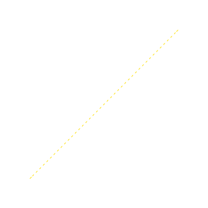
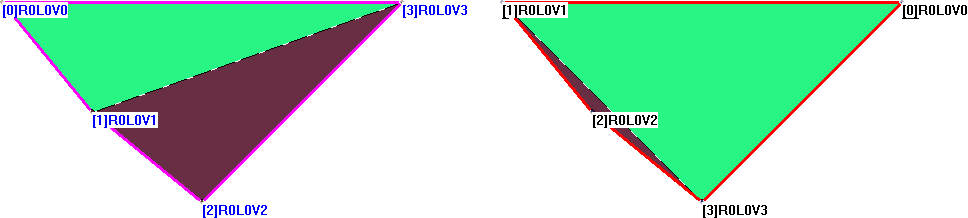

# 算法文档

**软硕163 周伯威 2016213588**

[TOC]

## 1. 定义

### 1.1 论文中三角剖分的定义

> ...
> 尽管有多种方法实现点集P的三角剖分，但是俄国数学家Delaunay在1934年证明，**必定存在且仅存在一种三角剖分(一般称之为Delaunay三角剖分)算法，使得所有三角形的最小内角之和最大。**
> ...
> Delaunay三角剖分的一个重要性质就是所谓“空圆盘”性质：对于任意Delaunay三角形，其开式圆盘不包含其他任何节点，所有Delaunay三角形互不重叠，且完整地覆盖整个问题域。

### 1.2 维基百科中三角剖分的定义

> 在 數學 和 計算幾何 領域, 平面上的點集 P 的 德勞內三角化 是一種 三角剖分 DT(P)，使得在 P 中沒有點嚴格處於 DT(P) 中任意一個三角形 外接圓 的內部。Delaunay 三角化 最大化了此三角剖分中三角形的最小角，換句話，此算法儘量避免出現「極瘦」的三角形。

### 1.3 上述两定义的比较

维基百科中给出的定义是论文中所谓空圆盘性质，而对于最大化最小角没有给出具体的说明，论文的定义中则明确指出了Delaunay算法使所有三角形最小内角之和最大。

下面给出一个反例说明论文中的两个定义是矛盾的。

如图，四边形$ABCD$是带剖分图形，满足:

* $\triangle ABC$是以$A$为直角的等腰直角三角形;
* $\triangle ACD$是以$\angle D$为顶角的等腰三角形;
* $D$点位于$\triangle ABC$外接圆内。

于是，按照最小角之和最大的定义，若切开边$AC$，则最小角之和为$\angle DCB$; 若切开边$BD$则最小角之和为$\angle ABC$。后者小于前者，于是应该切开$AC$。

但是此时点$D$位于$\triangle ABC$外接圆内，这便与另一定义矛盾。

**所以论文中给出的两个定义中至少有一个是错误的。**根据维基百科定义，可认为定义一错误。

### 1.4 空圆盘定义的问题

需要注意的是维基百科的定义是针对于点集的，而未规定多边形边界。当有多边形限制的时候此定义有不足之处，例如:

多边形$ABCDEFGH$下方的三角剖分用黄线表示，但此时点$F$位于$\triangle CDG$的外接圆内。如果换成平面点集，则可换成剖分$\triangle CDF$来避免破坏性质，但是内环的限制使得这种剖分不成立。

所以，对于多边形的三角剖分问题，三角剖分的定义应修正为: 任意一个三角形的外接圆内部不包含其他顶点，**除非该顶点与三角形某两顶点构成的三角形与多边形边界相交**。

## 2. 算法

### 2.1 论文算法

以上是论文给出的算法，没给证明，且叙述十分复杂，简单来说就是:

* 取出多边形一条边
* 从所有顶点中选出符合下列条件的顶点，作为候选顶点:
  * 顶点位于边左侧
  * 顶点与边端点连线不与多边形其他边相交
* 求出各个候选顶点与边构成的三角形的外接圆半径，选取使该半径最小的候选顶点，将构造的三角形作为一个剖分三角形，并从多边形中排除，更新边列表
* 重复上述步骤至边表为空

### 2.2 算法修正

论文算法有一个显而易见的问题，就是候选顶点的判断条件不充分。例如:

上图中，计算$AB$边时，点$C$是一个符合条件的候选顶点，但是$\triangle ABC$显然不能作为被剖分的三角形。

因此，候选顶点条件应加上判断，**顶点与边构成的三角形内不包含其他顶点**。

### 2.3 算法效率优化

上述算法的时间复杂度是$O(N^3)$，尽管作者声称是$O(N^2)$的。但是，如果先判断外接圆半径是否已经比当前最优值小($O(1)$)，则可能避免判断候选条件($O(N)$)，从而加快计算。根据实验，加入这个优化之后，当边数较多时，计算效率提高了数十倍。

### 2.4 算法进一步修正

我实现的第一个版本即是上述修正后的算法，但是后来发现该算法仍有严重问题。例如，还是这个图:

选取$AB$边时，$C$、$D$都是符合条件的候选顶点，$\triangle ABD$的外接圆半径更小，于是连接$BD$。但如果开始选择的是$BC$边，$A$、$D$是符合条件的候选顶点，$\triangle ABC$的外接圆半径更小，应当要连接$AC$边。这与之前的剖分结果不同，所以算法仍有问题。

根据Delaunay三角剖分的正确定义，候选顶点条件应加上**顶点与边构成的三角形的外接圆内部不包含其他顶点**，同时，2.2节中新加入的条件可以去除。加上这一判断条件后，因为合法顶点只有一个，无需再存储候选顶点。

### 2.5 新算法证明

首先，多边形的每条边左边都一定是剖分三角形，下面证明，由上述候选条件选择的第一个三角形可作为剖分三角形:

假设有两个顶点$P$、$Q$，它们都能与边$AB$构成合法的Delaunay三角形，那么，两个顶点与边分别构成的三角形外接圆内部不包含另一个顶点。假设$P$位于$\triangle QAB$外接圆外部，则有$\angle P<\angle Q$，则$Q$位于$\triangle PAB$外接圆内部，这不符合定义，所以点$P$在$\triangle QAB$外接圆上，此时选择$P$、$Q$是等价的。所以，如果顶点$P$符合候选顶点条件，那么$\triangle PAB$一定可以作为剖分三角形。

## 3. 算法复杂度

### 3.1 论文算法

* 需要$O(N)$轮的迭代来计算出所有的三角形
  * 计算一条边时，需要$O(N)$枚举其他顶点
    * 判断一个顶点是否合法时，需要$O(N)$判断是否与现有边相交
  * 从候选顶点中选取顶点需要$O(N)$时间比较半径大小

因此该算法是$O(N^3)$的，而非作者宣称的$O(N^2)$。

### 3.2 修正算法

计算一个顶点是否合法时，仍需要$O(N)$的时间来枚举其他顶点，因此该算法在最坏情况下仍然是$O(N^3)$的。

### 3.3 正多边形的情况

#### 3.3.1 论文算法

没有变化，仍然是$O(N^3)$。

#### 3.3.2 修正算法

在第二层循环中，每次找到第一个顶点即退出循环，所以复杂度降为$O(N^2)$。