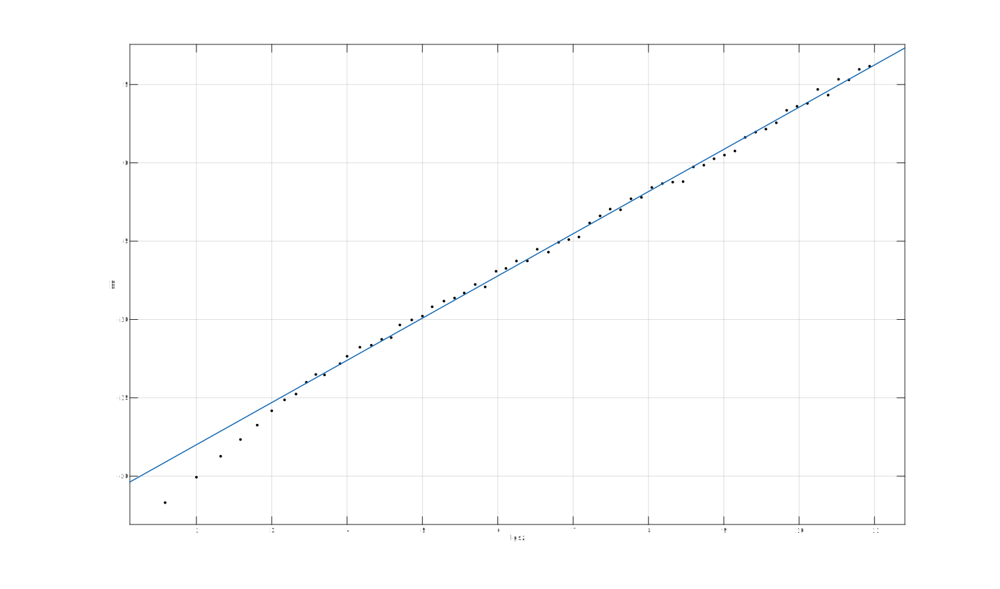
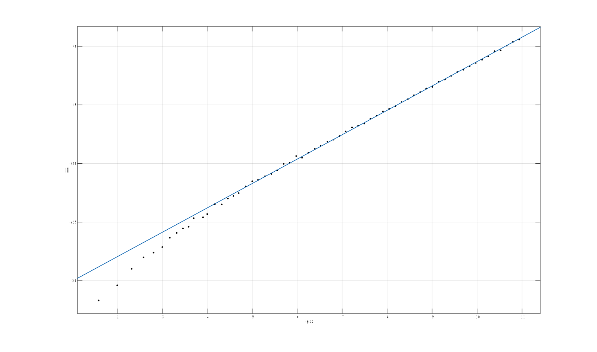
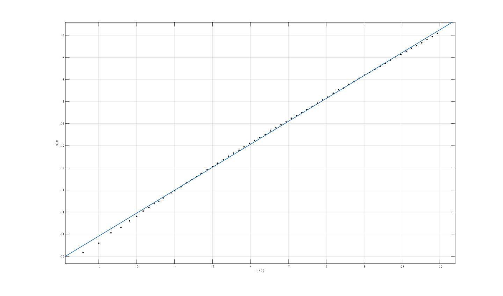

# 结果文档

**软硕163 周伯威 2016213588**

[TOC]

## 1. 功能测试

在算法文档中已对算法正确性进行了证明。功能上，我也进行了足够多的测试，可认为程序功能是正确的。

## 2. 性能测试

### 2.1 数据构造

测试程序提供两种多边形构造方式:

* `POLYGON_REGULAR`表示使用正多边形
* `POLYGON_BAR`表示使用一个长条形的多边形

``` c++
switch (type)
{
  case POLYGON_REGULAR:
    for (int i = 0; i < size; i++) {
      double theta = 2 * PI / size * i;
      points.push_back(Point(cos(theta), sin(theta)));
    }
    break;
  case POLYGON_BAR:
    for (int i = 0; i < size / 2; i++) {
      points.push_back(Point(i, 0));
    }
    for (int i = size / 2; i < size; i++) {
      points.push_back(Point(size - 1 - i, 1));
    }
    break;
}
```

### 2.2 测试方法

* 如果三角化函数执行时间小于一秒，则使执行次数翻倍，反复进行这个过程直到总时间超过一秒。使用该方法可得到单次执行函数的精确时间。
* 在函数的关键节点设置计数器，用于记录总执行次数。
* 多边形边数的选取是指数增加的，初始为3，每次在上次的基础上乘以1.1，直到边数超过2000。
* 将多边形边数、执行时间、总执行次数输出至文件。进行数据分析时，对这些数均取对数，因为边数是指数增长的，所以取对数之后取样点是均匀分布的，可进行更精准的直线拟合。

### 2.3 测试结果

由于论文里面有诸多错误，我的测试进行了三轮(因为每写好一次代码都测了一次。。):

* 论文递归算法，对论文中的小错误进行了修补
* 论文算法改进(`#define REWRITE`)，递归改为循环，同时调整剪枝顺序
* 修正后的正确的算法(`#define CORRECT`)

测试结果位于`doc/data/`文件夹，以`.tsv`格式存储，可用Microsoft Excel打开。

### 2.4 测试结果分析

使用Matlab对取对数之后的数据规模、耗时的关系进行直线拟合。

以下使用$T$表示时间，$N$表示数据规模(多边形边数)。

#### 2.4.1 Regular polygon, old algorithm



$$T(N) = 2^{-23.38}N^{2.694}$$

$$r^2 = 0.998$$

#### 2.4.2 Regular polygon, new algorithm



$$T(N) = 2^{-22.12}N^{2.082}$$

$$r^2 = 0.9993$$

#### 2.4.3 Regular polygon, correct algorithm


$$T(N) = 2^{-24.8}N^{1.953}$$

$$r^2 = 0.9999$$

#### 2.4.4 Bar polygon, old algorithm


$$T(N) = 2^{-23.04}N^{2.292}$$

$$r^2 = 0.9991$$

#### 2.4.5 Bar polygon, new algorithm


$$T(N) = 2^{-22.4}N^{2.065}$$

$$r^2 = 0.9995$$

#### 2.4.6 Bar polygon, correct algorithm



$$T(N) = 2^{-24.32}N^{2.074}$$

$$r^2 = 0.9994$$

## 3. 精美案例结果

### 3.1 产生方式

论文中的算法不支持对点集的剖分，为了实现点集剖分，我将多边形内部的点构造成一个个极小的三角形内环。

生成图案的步骤如下:

* 使用OpenCV读取图像，在图像区域内随机取点，并建立内环; 
* 建立一个正多边形外环;
* 对多边形做Delaunay三角剖分;
* 对于每个剖分得到的三角形，计算其中像素的平均颜色值，作为三角形的颜色;
* 绘制结果。

代码、工程位于`src/SuchPolygon`中。

### 3.2 案例结果 

|      不显示边线       |      显示边线       |
| :--------------: | :-------------: |
|  |  |
|  |  |
|  |  |
|  |  |

