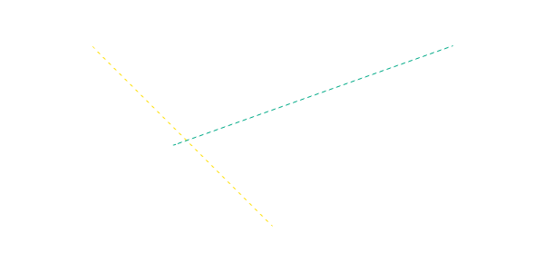
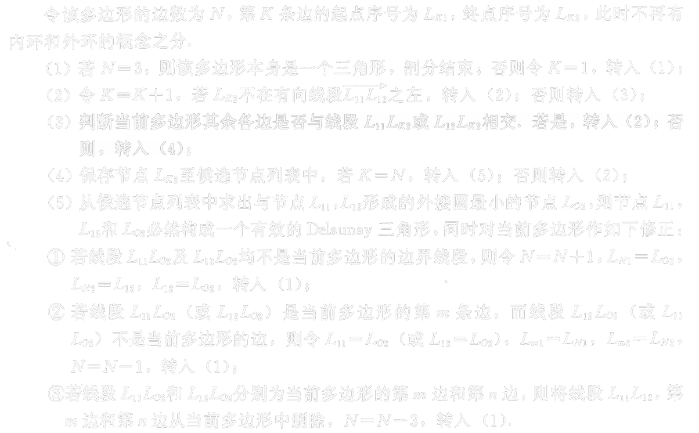
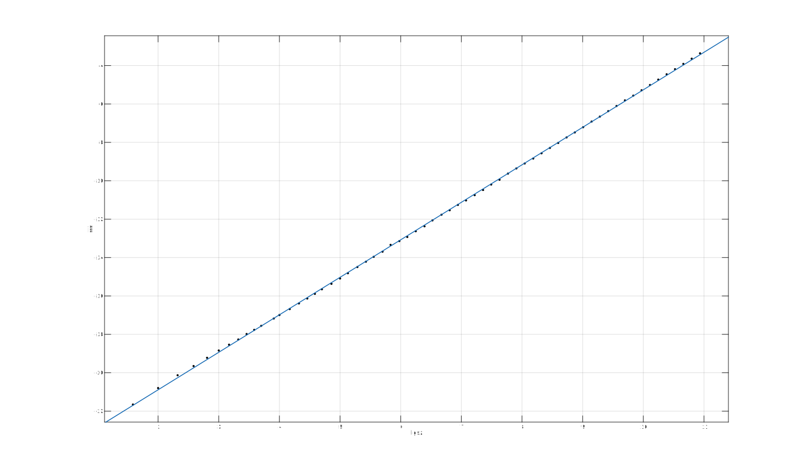
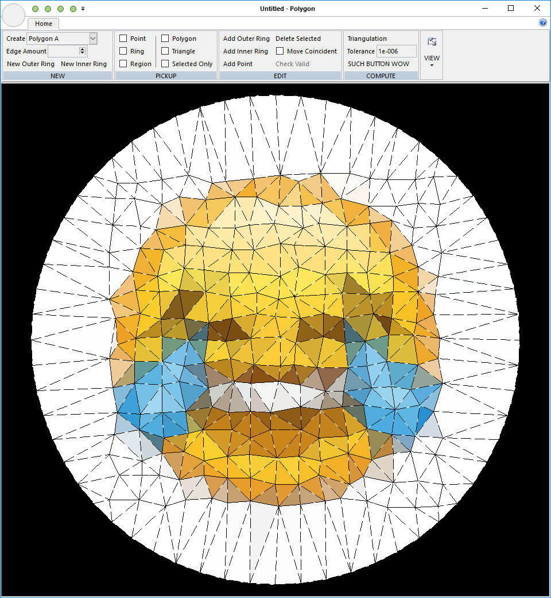
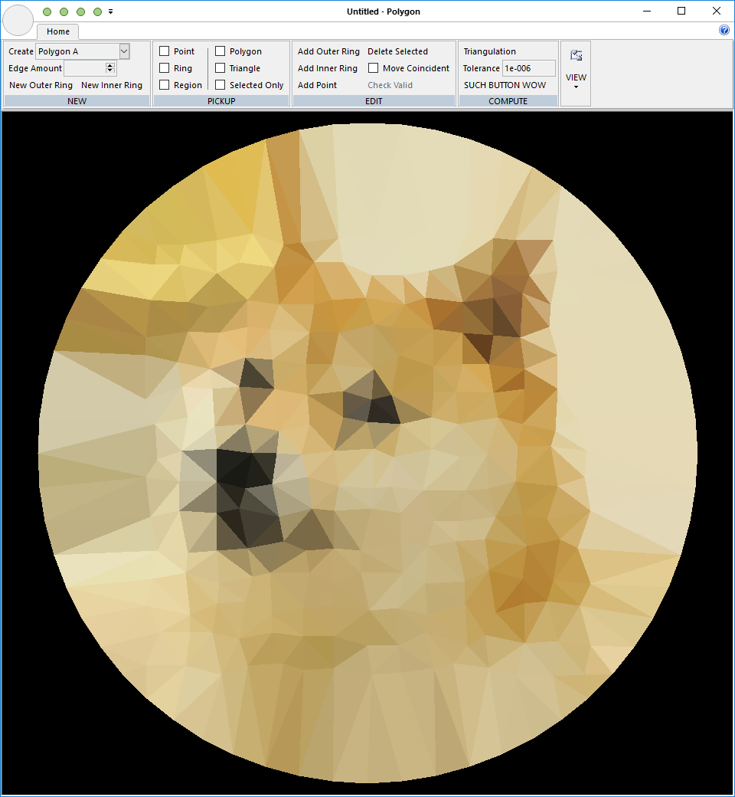

# Delaunay三角剖分作业

**软硕163 周伯威 2016213588**

[TOC]

# 使用说明

## 1. 操作方法

* 添加多边形$A$或多边形$B$
* 若多边形合法，程序会自动进行三角剖分并着色
* 移动多边形顶点、环等，若新多边形合法，程序会实时更新剖分结果

## 2. 编译选项

详见**技术文档: 3. 如何编译、运行或配置程序**

# 开发技术文档

## 1. 程序的框架结构

### 1.1 模块划分

#### 1.1.1 Delaunay三角化计算

在`class Delaunay`内实现了三角化相关的函数。其中重要的函数包括:

```c++
void computeEdges();
// 转换多边形类的数据结构，生成边表
void computeTriangulation();
// 计算三角化
bool isPointOnTheLeftOfVector(int p, Edge e);
// 判断顶点p是否在边e的左侧
bool isOtherEdgesIntersectWithVectors(Edge e1, Edge e2);
// 判断边e1、e2是否与其他边相交
bool isOtherPointsInTriangle(int p1, int p2, int p3);
// 判断p1、p2、p3构成的三角形内是否有其他顶点
bool isIn(Point p, Point p1, Point p2, Point p3);
// 判断点p是否位于p1、p2、p3构成的三角形内
int getMinimumCirclePointIDFromCandidates(int p1, int p2);
// 求候选顶点与点p1、p2构成三角形外接圆半径最小的顶点
int isPolygonEdge(int p1, int p2);
// 判断点p1、p2连线是否是多边形的边
void removeEdge(int idx);
// 从边表中删除一条边
bool isIntersection(Edge e1, Edge e2);
// 判断两边是否相交
double getCircumscribedCircleRadius(Point a, Point b, Point c);
// 求三角形外接圆半径
void reduceTriangle(int p);
// 确定剖分一个三角形，并移除
```

#### 1.1.2 Point类相关计算函数

```c++
Point operator +(Point a, Point b);		// 两个点坐标相加
Point operator -(Point a, Point b);		// 两个点坐标相减
double operator ^(Point a, Point b);	// 两个点距离
double operator >>(Point a, Point b);	// 一个点到另一个点的幅角差(有正负)
double operator !(Point a);				// 一个点的幅角
```

#### 1.1.3 三角化结果绘制

```c++
void CPolygonView::drawTriangleMesh(CDC* pDC, double scale, Point translation, int right, int bottom, TriangleMesh *mesh);
// 绘制多个三角形
void CPolygonView::drawTriangle(CDC* pDC, double scale, Point translation, int right, int bottom, Point u, Point v, Point w, int fill, int r, int g, int b);
// 绘制一个三角形，三角形在其构造函数中会随机分配一个颜色值
```

### 1.2 程序设计的整体思路

论文中给出了较详细的算法实现过程，共有5个步骤，我的实现也是按照这五个步骤进行的。

但是实际运行后发现效率较低，于是修改了函数结构与执行顺序，详见**2.1 效率优化**。

## 2. 编程用到的一些技巧

### 2.1 效率优化

#### 2.1.1 减少vector相关函数的使用

调试发现程序最内层循环中有较多的时间花在vector的`[]`和`size()`操作上，我减少了这些操作的使用，从而在常数上减少了代码运行时间。

#### 2.1.2 递归改写为循环

论文中的伪代码使用了递归方法，但实际上这个递归是没有必要的。我将递归写法改写成了循环，减少了程序对栈空间的消耗。

#### 2.1.3 剪枝

==论文中，先筛选候选顶点，再从候选顶点中找到最优三角形的方法效率很低。==

下面回顾一下论文的方法:

* 每轮迭代中，取出符合以下两点条件的顶点，放入候选顶点:
  * 顶点位于第一条边的左侧($O(1)$)
  * **顶点与第一条边构成的三角形可以作为三角剖分的三角形**($O(N)$)==(※)==
* 从候选顶点中选择与第一条边构成三角形的外接圆半径最小的顶点($O(1)$)
* 将这个顶点、第一条边连接成三角形，作为一个剖分三角形($O(1)$)。进入下一轮迭代。

==※ 注==: 论文中此步骤有误，详见**原理文档**。

上述论文方法中，加粗的部分的时间复杂度为$O(N)$，其中$N$为边数。对于一般的多边形，候选顶点的第一个条件很容易满足，因而很容易进入第二个条件的判断，这使得总的复杂度高达$O(N^3)$。

我更改了程序执行的顺序，首先判断外接圆半径是否比当前的最小半径小，若不是，则直接判断下一个顶点。

从运行结果上看，当边数较多的时候，该方法大幅度降低了程序运行时间。详见**结果文档**。

#### 2.1.4 双缓存绘图

默认给出的绘图方式会导致绘图区闪烁，使用双缓存绘图可解决。

#### 2.1.5 浮点数误差的处理

在修正算法中，可能有浮点数误差的问题。例如，正多边形的各个顶点是共圆的，而误差的存在使得顶点在圆上、圆内、圆外的判定会出现问题。

实际判断点在圆内时，将圆半径减去$10^{-8}$以消除影响。

### 2.2 测试技巧

* 如果三角化函数执行时间小于一秒，则使执行次数翻倍，反复进行这个过程直到总时间超过一秒。使用该方法可得到单次执行函数的精确时间。
* 在函数的关键节点设置计数器，用于记录总执行次数。
* 多边形边数的选取是指数增加的，初始为3，每次在上次的基础上乘以1.1，直到边数超过2000。
* 将多边形边数、执行时间、总执行次数输出至文件。进行数据分析时，对这些数均取对数，因为边数是指数增长的，所以取对数之后取样点是均匀分布的，可进行更精准的直线拟合。

## 3. 如何编译、运行或配置程序

### 3.1 三角剖分程序

* 运行环境:
  * Visual Studio 2012 with MFC


* 编译选项:

  * `PolygonView.cpp`中，修改

    ```c++
    #define ZBW_IS_DEBUGGING 0
    ```

    当参数为0时表示使用`try-catch`对多边形的错误进行捕获，如果输入多边形有误则会提示用户;

    当参数为1时，如果输入多边形有误则程序会停止运行。

  * `PolygonView.cpp`中，修改

    ```c++
    #define DYNAMIC 1
    ```

    当参数为0时表示实时刷新多边形的三角剖分;

    当参数为1时，点击Trianglation才会重新进行三角剖分。

  * `PolygonView.cpp`中，修改

    ```c++
    #define DOUBLE_BUFFER 1
    ```

    当参数为0时表示使用双缓存绘图;

    当参数为1时不使用双缓存绘图，界面会闪烁。

* 运行方法

  * 切换至Release模式，直接编译、运行;
  * 添加好多边形后，点击"Trianglation"按钮即可进行三角剖分;
  * 可分别剖分多边形A、多边形B。

### 3.2 测试程序

* 运行环境:
  * Visual Studio 2015 (注: 因VS2015提供了更高级的测试工具而VS2012没有)


* 编译选项:

  * 程序使用了递归方法，所以当多边形边数过多时，会报stack overflow错误，需要调整栈空间;

  * 修改**项目属性-链接器-系统-堆栈保留大小(/STACK: reserve)**为100000000(100MB)以上即可。

  * `Delaunay.h`中，修改

    ```c++
    #define REWRITE
    ```

    该行被注释时，使用论文算法(较慢);

    取消注释则使用新算法(较快)。

* 运行方法:

  * `main()`函数位于`test.cpp`中;

  * 程序内置了两种测试多边形:

    * `POLYGON_REGULAR`表示使用正多边形
    * `POLYGON_BAR`表示使用一个长条形的多边形

  * `Test::test()`函数的使用方法:

    ```c++
    void test(int max_size, int type, std::string file);
    /*
    Parameters:
    * max_size - 多边形的最大边数，程序会测试从三条边逐渐增加至不超过max_size的边数(使用指数增长);
    * type - POLYGON_REGULAR 或者 POLYGON_BAR;
    * file - 测试结果文件输出的路径。
    */
    ```

  * 输出: 

    * 输出是一个文本文件，存为`*.tsv`格式可用Microsoft Excel打开;
    * 第一行是表头，其余每一行是一组数据，数据各项由制表符分隔;
    * 每组数据包括:
      1. 多边形边数
      2. 运行耗时(秒)
      3. $\log_2{边数}$
      4. $\log_2{{耗时}}$
      5. 函数执行计数
      6. $\log_2{{函数执行计数}}$

# 算法文档

## 1. 定义

### 1.1 论文中三角剖分的定义

> ...
> 尽管有多种方法实现点集P的三角剖分，但是俄国数学家Delaunay在1934年证明，**必定存在且仅存在一种三角剖分(一般称之为Delaunay三角剖分)算法，使得所有三角形的最小内角之和最大。**
> ...
> Delaunay三角剖分的一个重要性质就是所谓“空圆盘”性质：对于任意Delaunay三角形，其开式圆盘不包含其他任何节点，所有Delaunay三角形互不重叠，且完整地覆盖整个问题域。

### 1.2 维基百科中三角剖分的定义

> 在 數學 和 計算幾何 領域, 平面上的點集 P 的 德勞內三角化 是一種 三角剖分 DT(P)，使得在 P 中沒有點嚴格處於 DT(P) 中任意一個三角形 外接圓 的內部。Delaunay 三角化 最大化了此三角剖分中三角形的最小角，換句話，此算法儘量避免出現「極瘦」的三角形。

### 1.3 上述两定义的比较

维基百科中给出的定义是论文中所谓空圆盘性质，而对于最大化最小角没有给出具体的说明，论文的定义中则明确指出了Delaunay算法使所有三角形最小内角之和最大。

下面给出一个反例说明论文中的两个定义是矛盾的。



如图，四边形$ABCD$是带剖分图形，满足:

* $\triangle ABC$是以$A$为直角的等腰直角三角形;
* $\triangle ACD$是以$\angle D$为顶角的等腰三角形;
* $D$点位于$\triangle ABC$外接圆内。

于是，按照最小角之和最大的定义，若切开边$AC$，则最小角之和为$\angle DCB$; 若切开边$BD$则最小角之和为$\angle ABC$。后者小于前者，于是应该切开$AC$。

但是此时点$D$位于$\triangle ABC$外接圆内，这便与另一定义矛盾。

**所以论文中给出的两个定义中至少有一个是错误的。**根据维基百科定义，可认为定义一错误。

### 1.4 空圆盘定义的问题

需要注意的是维基百科的定义是针对于点集的，而未规定多边形边界。当有多边形限制的时候此定义有不足之处，例如:


多边形$ABCDEFGH$下方的三角剖分用黄线表示，但此时点$F$位于$\triangle CDG$的外接圆内。如果换成平面点集，则可换成剖分$\triangle CDF$来避免破坏性质，但是内环的限制使得这种剖分不成立。

所以，对于多边形的三角剖分问题，三角剖分的定义应修正为: 任意一个三角形的外接圆内部不包含其他顶点，**除非该顶点与三角形某两顶点构成的三角形与多边形边界相交**。

## 2. 算法

### 2.1 论文算法



以上是论文给出的算法，没给证明，且叙述十分复杂，简单来说就是:

* 取出多边形一条边
* 从所有顶点中选出符合下列条件的顶点，作为候选顶点:
  * 顶点位于边左侧
  * 顶点与边端点连线不与多边形其他边相交
* 求出各个候选顶点与边构成的三角形的外接圆半径，选取使该半径最小的候选顶点，将构造的三角形作为一个剖分三角形，并从多边形中排除，更新边列表
* 重复上述步骤至边表为空

### 2.2 算法修正

论文算法有一个显而易见的问题，就是候选顶点的判断条件不充分。例如:


上图中，计算$AB$边时，点$C$是一个符合条件的候选顶点，但是$\triangle ABC$显然不能作为被剖分的三角形。

因此，候选顶点条件应加上判断，**顶点与边构成的三角形内不包含其他顶点**。

### 2.3 算法效率优化

上述算法的时间复杂度是$O(N^3)$，尽管作者声称是$O(N^2)$的。但是，如果先判断外接圆半径是否已经比当前最优值小($O(1)$)，则可能避免判断候选条件($O(N)$)，从而加快计算。根据实验，加入这个优化之后，当边数较多时，计算效率提高了数十倍。

### 2.4 算法进一步修正

我实现的第一个版本即是上述修正后的算法，但是后来发现该算法仍有严重问题。例如，还是这个图:


选取$AB$边时，$C$、$D$都是符合条件的候选顶点，$\triangle ABD$的外接圆半径更小，于是连接$BD$。但如果开始选择的是$BC$边，$A$、$D$是符合条件的候选顶点，$\triangle ABC$的外接圆半径更小，应当要连接$AC$边。这与之前的剖分结果不同，所以算法仍有问题。


根据Delaunay三角剖分的正确定义，候选顶点条件应加上**顶点与边构成的三角形的外接圆内部不包含其他顶点**，同时，2.2节中新加入的条件可以去除。加上这一判断条件后，因为合法顶点只有一个，无需再存储候选顶点。

### 2.5 新算法证明

首先，多边形的每条边左边都一定是剖分三角形，下面证明，由上述候选条件选择的第一个三角形可作为剖分三角形:

假设有两个顶点$P$、$Q$，它们都能与边$AB$构成合法的Delaunay三角形，那么，两个顶点与边分别构成的三角形外接圆内部不包含另一个顶点。假设$P$位于$\triangle QAB$外接圆外部，则有$\angle P<\angle Q$，则$Q$位于$\triangle PAB$外接圆内部，这不符合定义，所以点$P$在$\triangle QAB$外接圆上，此时选择$P$、$Q$是等价的。所以，如果顶点$P$符合候选顶点条件，那么$\triangle PAB$一定可以作为剖分三角形。

## 3. 算法复杂度

### 3.1 论文算法

* 需要$O(N)$轮的迭代来计算出所有的三角形
  * 计算一条边时，需要$O(N)$枚举其他顶点
    * 判断一个顶点是否合法时，需要$O(N)$判断是否与现有边相交
  * 从候选顶点中选取顶点需要$O(N)$时间比较半径大小

因此该算法是$O(N^3)$的，而非作者宣称的$O(N^2)$。

### 3.2 修正算法

计算一个顶点是否合法时，仍需要$O(N)$的时间来枚举其他顶点，因此该算法在最坏情况下仍然是$O(N^3)$的。

### 3.3 正多边形的情况

#### 3.3.1 论文算法

没有变化，仍然是$O(N^3)$。

#### 3.3.2 修正算法

在第二层循环中，每次找到第一个顶点即退出循环，所以复杂度降为$O(N^2)$。

# 结果文档

## 1. 功能测试

在算法文档中已对算法正确性进行了证明。功能上，我也进行了足够多的测试，可认为程序功能是正确的。

## 2. 性能测试

### 2.1 数据构造

测试程序提供两种多边形构造方式:

* `POLYGON_REGULAR`表示使用正多边形
* `POLYGON_BAR`表示使用一个长条形的多边形

```c++
switch (type)
{
  case POLYGON_REGULAR:
    for (int i = 0; i < size; i++) {
      double theta = 2 * PI / size * i;
      points.push_back(Point(cos(theta), sin(theta)));
    }
    break;
  case POLYGON_BAR:
    for (int i = 0; i < size / 2; i++) {
      points.push_back(Point(i, 0));
    }
    for (int i = size / 2; i < size; i++) {
      points.push_back(Point(size - 1 - i, 1));
    }
    break;
}
```

### 2.2 测试方法

* 如果三角化函数执行时间小于一秒，则使执行次数翻倍，反复进行这个过程直到总时间超过一秒。使用该方法可得到单次执行函数的精确时间。
* 在函数的关键节点设置计数器，用于记录总执行次数。
* 多边形边数的选取是指数增加的，初始为3，每次在上次的基础上乘以1.1，直到边数超过2000。
* 将多边形边数、执行时间、总执行次数输出至文件。进行数据分析时，对这些数均取对数，因为边数是指数增长的，所以取对数之后取样点是均匀分布的，可进行更精准的直线拟合。

### 2.3 测试结果

由于论文里面有诸多错误，我的测试进行了三轮(因为每写好一次代码都测了一次。。):

* 论文递归算法，对论文中的小错误进行了修补
* 论文算法改进(`#define REWRITE`)，递归改为循环，同时调整剪枝顺序
* 修正后的正确的算法(`#define CORRECT`)

测试结果位于`doc/data/`文件夹，以`.tsv`格式存储，可用Microsoft Excel打开。

### 2.4 测试结果分析

使用Matlab对取对数之后的数据规模、耗时的关系进行直线拟合。

以下使用$T$表示时间，$N$表示数据规模(多边形边数)。

#### 2.4.1 Regular polygon, old algorithm


$$T(N) = 2^{-23.38}N^{2.694}$$

$$r^2 = 0.998$$

#### 2.4.2 Regular polygon, new algorithm


$$T(N) = 2^{-22.12}N^{2.082}$$

$$r^2 = 0.9993$$

#### 2.4.3 Regular polygon, correct algorithm



$$T(N) = 2^{-24.8}N^{1.953}$$

$$r^2 = 0.9999$$

#### 2.4.4 Bar polygon, old algorithm


$$T(N) = 2^{-23.04}N^{2.292}$$

$$r^2 = 0.9991$$

#### 2.4.5 Bar polygon, new algorithm


$$T(N) = 2^{-22.4}N^{2.065}$$

$$r^2 = 0.9995$$

#### 2.4.6 Bar polygon, correct algorithm


$$T(N) = 2^{-24.32}N^{2.074}$$

$$r^2 = 0.9994$$

## 3. 精美案例结果

### 3.1 产生方式

论文中的算法不支持对点集的剖分，为了实现点集剖分，我将多边形内部的点构造成一个个极小的三角形内环。

生成图案的步骤如下:

* 使用OpenCV读取图像，在图像区域内随机取点，并建立内环; 
* 建立一个正多边形外环;
* 对多边形做Delaunay三角剖分;
* 对于每个剖分得到的三角形，计算其中像素的平均颜色值，作为三角形的颜色;
* 绘制结果。

代码、工程位于`src/SuchPolygon`中。

### 3.2 案例结果

|      不显示边线       |      显示边线       |
| :--------------: | :-------------: |
|  |  |
|  |  |
|  |  |
|  |  |

